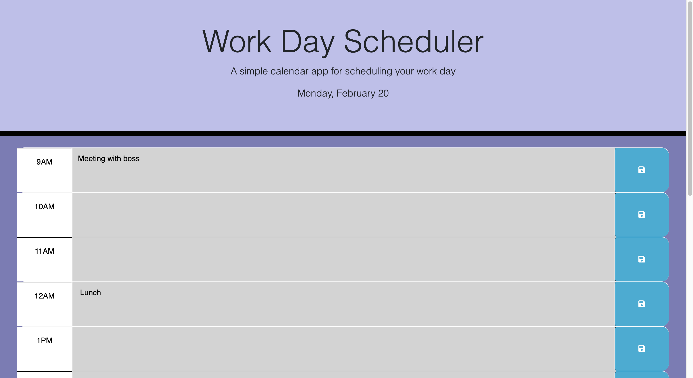

# challenge-5-calendar

Interactive calendar application

## Description

An employee with a busy schedule wants a simple daily planner to add important events to so they can manage their time effectively. This web app needed to track user input data even if the browser is closed or refreshed. The employee wantedto be able to visibly see where they are in there day timewise.  

URL: https://therealsweven.github.io/challenge-5-calendar/

## Installation

N/A

## Usage

This web app contains a simple day planner with hours ranging fom 9AM to 9PM. The user may input whatever text they would like in each hour slot and click the save button to save the input text in local storage. On load or refresh, the code pulls the currently save localStorage data and displays it in each corresponding text area so the user can see what they had put in there previously. The app compares the current hour to each hour block and applies custom styling so the user may see how far along they are in there day. The red block is the current hour, gray blocks are hours that have already passed, and green blocks are hours the user has not reached yet in their day. The planner displays the current weekday and date in the header for reference.

## Credits

N/A

## License

N/A

## Badges

N/As

## Features

N/A

## How to Contribute

N/A

## Tests

N/A
